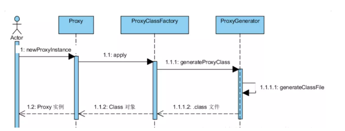
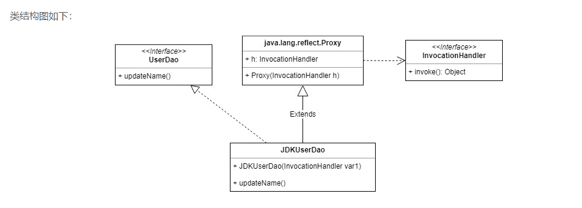

[TOC]


### 反射机制（前提）

> 在运行状态下，对于任意一个类，都能知道它的所有方法和属性；对于任意一个对象，都能调用它的所有方法和属性，这种动态获取信息和动态调用的机制叫做java的反射机制。


### 动态代理

>在运行时创建代理类

##### JDK动态代理实现

- 通过实现InvocationHandler实现自己的调用处理器；

- **通过Proxy指定ClassLoader和一组interface动态创建代理类**（proxy class）；

- 通过反射机制动态获取构造函数，唯一参数是调用处理器接口类型；

- 通过构造器创建动态代理类实例，构造是调用处理器对象作参数传入；

  

  ```
  /**
  *@Param loader：classLoder
  *@param interfaces: 接口
  *@param h: 处理器
  */
  public static Object newProxyInstance(ClassLoader loader,
                                         Class<?>[] interfaces,
                                            InvocationHandler h)
          throws IllegalArgumentException{
         
          Objects.requireNonNull(h);
          final Class<?>[] intfs = interfaces.clone();
          final SecurityManager sm = System.getSecurityManager();
          if (sm != null) {
              checkProxyAccess(Reflection.getCallerClass(), loader, intfs);
          }
           //生成代理类对象，底层还是通过字节码
          Class<?> cl = getProxyClass0(loader, intfs);
          //使用指定的调用处理程序获取代理类的构造函数对象
          try {
              if (sm != null) {
                  checkNewProxyPermission(Reflection.getCallerClass(), cl);
              }
  
              final Constructor<?> cons = cl.getConstructor(constructorParams);
              final InvocationHandler ih = h;
              //如果Class作用域为私有，通过 setAccessible 支持访问
              if (!Modifier.isPublic(cl.getModifiers())) {
                  AccessController.doPrivileged(new PrivilegedAction<Void>() {
                      public Void run() {
                          cons.setAccessible(true);
                          return null;
                      }
                  });
              }
              //获取Proxy Class构造函数，创建Proxy代理实例。
              return cons.newInstance(new Object[]{h});
          } catch (IllegalAccessException|InstantiationException e) {
              throw new InternalError(e.toString(), e);
          } catch (InvocationTargetException e) {
              Throwable t = e.getCause();
              if (t instanceof RuntimeException) {
                  throw (RuntimeException) t;
              } else {
                  throw new InternalError(t.toString(), t);
              }
          } catch (NoSuchMethodException e) {
              throw new InternalError(e.toString(), e);
          }
      }
  ```

  ##### jdk的动态代理只能面向接口的原因

  

  > 生成的代理类的结构是extend proxy的一个类，由于继承的单根性，所以不能面向类。
  >
  > 我的理解是这样的：要生成一个代理类对象，需要一个模板，Java里面的引用模板有两种，一种是继承类，一种是引用接口，这种机制已经继承proxy，所以不能依赖类去做模板了，只能面向接口

  

##### cglib动态代理实现

> cglib是一个java字节码生成工具，动态生成被代理类的子类，子类重写父类所有不是final的方法，并在子类拦截所有的父类方法

- 生成代理类的字节码文件；

- 加载字节码文件，生成代理类**Class对象**（proxy class）；

- 反射机器获取代理**类对象的构造器**，生成代理类实例；

  

  从类结构上可以看出，针对接口的代理就是对 接口创建了一个实现类，针对类的代理就是创建了一个类的子类。所以这就是为什么 CGLIB 可以实现针对类的代理的原因。直接生成子类，没有像 JDK 动态代理那样绕来绕去。

  由于生成的代理类是被代理类的子类，所以被代理类的方法不能是 final 的，否则生成的代理类不会重写被代理类的方法，就不会执行 MethodInterceptor.intercept 方法。

  